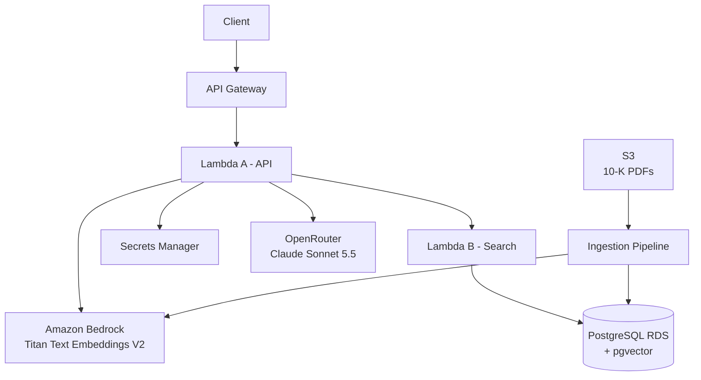

# AWS RAG System for SEC 10-K Filings

A production-style Retrieval-Augmented Generation (RAG) system for asking questions about SEC 10-K filings using AWS, PostgreSQL/pgvector, Amazon Bedrock embeddings, and Claude through OpenRouter.

## Highlights

* **Split Lambda architecture:** API Lambda handles embedding/generation; Search Lambda handles private RDS retrieval, with no NAT gateway required.
* **Read-only database access:** Search Lambda uses IAM database authentication with a dedicated `rag_reader` PostgreSQL role.
* **Retrieval cutoff before the LLM:** Low-confidence retrievals are rejected before generation instead of allowing the model to guess.
* **Terraform remote state:** Infrastructure state is stored in an encrypted, versioned S3 backend with state locking.
* **CI without AWS credentials:** GitHub Actions runs tests, Ruff, and Terraform validation without making AWS API calls.

## Architecture



### Request flow

1. Client sends a question to API Gateway.
2. API Gateway invokes the API Lambda.
3. API Lambda generates a Titan Text Embeddings V2 embedding for the question.
4. API Lambda invokes the Search Lambda.
5. Search Lambda queries PostgreSQL/pgvector using cosine distance.
6. Results above the retrieval-distance cutoff are discarded.
7. Relevant chunks are assembled into context.
8. API Lambda retrieves the OpenRouter API key from Secrets Manager.
9. Claude generates the final answer using only the retrieved context.
10. API Lambda returns the answer to the client.

### Why two Lambdas?

The Search Lambda is placed in the VPC because it needs private network access to RDS.

The API Lambda stays outside the VPC because it needs access to public AWS services and OpenRouter.

This avoids putting the API Lambda behind a NAT gateway.

The Search Lambda does **not** need internet access. Its only external dependency is RDS. The RDS IAM authentication token is generated locally by the AWS SDK as a signed token; generating the token itself does not require a network call.

An alternative would be VPC endpoints, but those would add roughly **$29/month** in endpoint charges. A NAT gateway would be roughly **$33/month** before data-processing charges. For this small RAG system, neither is justified.

## Why IAM database authentication?

The main reason is networking.

The Search Lambda runs inside the VPC. If it retrieved a database password from Secrets Manager at runtime, that traffic would require either internet access through a NAT gateway or a paid VPC endpoint.

Instead, the Lambda generates an RDS IAM authentication token locally and connects directly to RDS.

IAM authentication also provides a useful security benefit: the application does not need to store or distribute a database password for the read-only Lambda user.

The Search Lambda receives only:

* RDS endpoint
* database name
* database username
* IAM permissions for `rds-db:connect`

## Retrieval

The system uses Amazon Titan Text Embeddings V2 with 1,024-dimensional vectors stored in PostgreSQL using pgvector.

The database performs cosine-distance nearest-neighbor search:

```sql
ORDER BY embedding <=> query_embedding
LIMIT 5
```

### Chunking

The ingestion pipeline:

* extracts text page-by-page from each PDF
* cleans the extracted text
* uses a **2,000-character chunk size**
* uses **200 characters of overlap**
* keeps page boundaries as metadata
* stores the source document, page number, chunk index, text, and embedding

This preserves enough local context while keeping retrieved passages reasonably small.

## HNSW investigation

The database contains an HNSW vector index.

With only **602 chunks**, PostgreSQL's planner chose a sequential scan for the tested query.

To measure the index independently, HNSW was forced with:

```sql
SET enable_seqscan = off;
```

In a single test run:

* Sequential scan: approximately **5.4 ms**
* Forced HNSW: approximately **0.48 ms**
* Approximately **11× faster** for that query

This is not presented as a formal benchmark. The important engineering observation is that HNSW is already available for scaling, while PostgreSQL reasonably prefers a sequential scan at the current dataset size.

## Retrieval cutoff

The system currently uses a provisional cosine-distance cutoff of:

```text
0.70
```

The initial tests observed:

* Relevant retrieval: approximately **0.46**
* Clearly off-topic retrieval: approximately **0.90**

The `0.70` cutoff was therefore chosen as an initial boundary between those observed cases.

This is explicitly provisional. The first planned evaluation task is **cutoff calibration** using a larger labeled question set.

The cutoff is applied **before** generation. If the best retrieved result is too far away, the system returns:

> I don't know based on the provided documents.

This prevents weak retrieval from being passed to the LLM.

## Example

Question:

> How much did NVIDIA spend on research and development?

The system retrieves NVIDIA 2025 10-K, page 52.

Example answer:

> NVIDIA spent $12.914 billion on research and development in fiscal 2025, compared with $8.675 billion in fiscal 2024 and $7.339 billion in fiscal 2023. Source: NVIDIA 2025 10-K, p. 52.

The best retrieved chunk had a cosine distance of approximately 0.46.

## Handling weak retrieval

A useful failure case was a question about Apple's risks related to China.

None of the top five retrieved chunks were actually about China. Rather than allowing the LLM to infer an answer from weakly related material, the retrieval layer rejected the result and returned:

> I don't know based on the provided documents.

This demonstrates **semantic dilution**: semantically related financial text can still be insufficiently specific for a question.

The faithful rejection is a strength of the system. It is preferable to confidently generating an unsupported answer.

## Generation

Answer generation uses Claude Sonnet 5.5 through OpenRouter.

The generation prompt explicitly requires:

* using only supplied document context
* no outside knowledge
* no invented citations
* an explicit "I don't know" response when context is insufficient
* concise answers
* source/page citations for factual claims

The OpenRouter API key is stored in AWS Secrets Manager and is not placed in Terraform state.

## Data

The current dataset contains:

| Document         |   Pages |  Chunks |
| ---------------- | ------: | ------: |
| Apple 2024 10-K  |     121 |     277 |
| NVIDIA 2025 10-K |     130 |     325 |
| **Total**        | **251** | **602** |

Embeddings are generated using Amazon Titan Text Embeddings V2.

## Testing

The test suite focuses on deterministic application behavior and does **not** make real AWS calls.

It includes:

* chunking tests
* loader tests
* RAG retrieval/cutoff tests
* API validation tests
* API error-handling tests
* module import smoke tests
* Ruff linting

The import smoke tests are particularly useful because Ruff cannot detect every runtime import problem. For example, a typo such as:

```python
from rag.embed import embed
```

instead of:

```python
from rag.embeddings import embed
```

can pass static linting but fail when the module is actually imported.

Run locally:

```bash
uv run ruff check .
env -u DB_HOST uv run pytest -q
```

## CI

GitHub Actions runs on pushes and pull requests.

The Python job:

1. installs `uv`
2. installs locked dependencies
3. runs Ruff
4. runs pytest

The Terraform job:

1. checks Terraform formatting
2. initializes Terraform without the backend
3. runs `terraform validate`

CI does not require AWS credentials.

## Deployment

Deployment is intentionally ordered so that generated Lambda packages exist before Terraform attempts to create the Lambda functions.

`scripts/deploy.sh`:

1. runs Ruff
2. runs tests
3. builds the Search Lambda package
4. builds the API Lambda package
5. runs Terraform apply

The generated `lambda/search/` and `lambda/api/` directories are build artifacts and are intentionally gitignored.

## From-scratch setup

### Step 0 — Rename the S3 buckets

S3 bucket names are globally unique across AWS.

Before running the setup, choose your own bucket names and change them in:

```text
bootstrap/main.tf
infra/versions.tf
infra/storage.tf
```

In particular:

* `bootstrap/main.tf` contains the Terraform state bucket.
* `infra/versions.tf` contains the Terraform backend bucket name.
* `infra/storage.tf` contains the document bucket name.

`infra/storage.tf` currently **imports** the existing document bucket because it was created before Terraform management was added.

For a brand-new environment, you should change the storage configuration so Terraform **creates** your newly named document bucket rather than importing the original project bucket.

### Step 1 — Bootstrap Terraform state

From the repository root:

```bash
terraform -chdir=bootstrap init
terraform -chdir=bootstrap apply
```

This creates the S3 bucket used for Terraform remote state.

### Step 2 — Deploy infrastructure

Run the deployment script:

```bash
./scripts/deploy.sh
```

This is the correct first infrastructure deployment on a fresh clone because it:

1. runs the tests
2. runs Ruff
3. builds both Lambda packages
4. creates the Lambda ZIPs
5. runs Terraform apply

Terraform then creates the AWS infrastructure, including the RDS instance.

The Search Lambda can be deployed before any document data exists. It will simply return no useful retrieval results until ingestion has populated the database.

### Step 3 — Create the database schema

After RDS is available, connect as the administrative database user.

Set your database connection variables:

```bash
export PGHOST="$(terraform -chdir=infra output -raw db_endpoint)"
export PGPORT="$(terraform -chdir=infra output -raw db_port)"
export PGDATABASE="rag"
export PGUSER="rag"
```

Export the database password when required by your connection method:

```bash
export PGPASSWORD="YOUR_RDS_PASSWORD"
```

Then run the schema and permissions scripts:

```bash
psql \
  -f sql/001_create_chunks.sql \
  -f sql/002_hnsw_index.sql \
  -f sql/003_iam_reader.sql
```

The scripts create:

1. the `chunks` table
2. the HNSW vector index
3. the read-only `rag_reader` IAM-authenticated role

### Step 4 — Configure ingestion

Set the AWS region and S3 bucket used by the ingestion pipeline.

For example:

```bash
export AWS_REGION="us-east-1"
export DOCUMENT_BUCKET="YOUR_DOCUMENT_BUCKET"
```

Upload the 10-K PDFs to the appropriate S3 location.

Then run ingestion:

```bash
uv run python -m rag.ingest
```

The ingestion pipeline extracts, cleans, chunks, embeds, and stores the documents.

The ingestion process is designed to be idempotent so rerunning it does not require manually rebuilding the database.

### Step 5 — Configure API deployment variables

Set the model configuration when needed:

```bash
export CLAUDE_MODEL_ID="anthropic/claude-sonnet-5.5"
```

The Terraform configuration also supplies the Search Lambda name and retrieval cutoff to the API Lambda.

The OpenRouter API key must exist in Secrets Manager under:

```text
rag/openrouter-api-key
```

The secret value should contain the OpenRouter API key.

### Step 6 — Subsequent deployments

After the initial setup, use:

```bash
./scripts/deploy.sh
```

This guarantees that the Lambda packages are rebuilt from the current source before Terraform packages them.

## API

The API exposes:

```text
POST /ask
```

Example request:

```json
{
  "question": "How much did NVIDIA spend on research and development?"
}
```

Example response:

```json
{
  "answer": "NVIDIA spent $12.914 billion in fiscal 2025..."
}
```

The endpoint uses AWS IAM authorization.

Example signed request:

```bash
(
  eval "$(aws configure export-credentials --format env)"
  curl -s -X POST \
    "$(terraform -chdir=infra output -raw api_url)/ask" \
    --aws-sigv4 "aws:amz:us-east-1:execute-api" \
    --user "$AWS_ACCESS_KEY_ID:$AWS_SECRET_ACCESS_KEY" \
    -H "x-amz-security-token: $AWS_SESSION_TOKEN" \
    -H "Content-Type: application/json" \
    -d '{"question": "How much did NVIDIA spend on research and development?"}'
)
```

## Security

Key security decisions include:

* S3 public access blocked
* RDS storage encrypted
* dedicated read-only database role
* IAM database authentication
* Lambda-to-RDS security-group rules
* Secrets Manager for the OpenRouter API key
* no secrets stored in Terraform configuration
* no secret values stored in Terraform state
* API Gateway IAM authorization
* API input validation
* internal error details are not returned to API clients

The RDS instance is currently publicly accessible for development convenience, but its security group restricts PostgreSQL access to the configured IP address and the Search Lambda security group.

## Cost

Approximate monthly cost at this project's small traffic level:

| Component          |                                Approximate cost |
| ------------------ | ----------------------------------------------: |
| RDS `db.t3.micro`  |                                      ~$15/month |
| RDS public IPv4    |                        Included in RDS estimate |
| Lambda             |                             ~$0 at this traffic |
| API Gateway        |                             ~$0 at this traffic |
| S3 Terraform state |                                             ~$0 |
| S3 documents       |                   Very low at this dataset size |
| Titan embeddings   |              < $0.01 for the initial 602 chunks |
| OpenRouter         |                           ~$0.01–$0.02/question |
| Secrets Manager    | ~$0.40/month per secret, ~$0.80 for two secrets |
| NAT Gateway        |                               **$0 — not used** |
| VPC endpoints      |                               **$0 — not used** |

The RDS estimate includes the public IPv4 address currently attached to the database. After the networking hardening described in Stage 6e, that public IPv4 address can be removed.

The OpenRouter API key also has a **$2 hard spending limit** configured as an additional safeguard.

For temporary development environments, AWS resources can be paused or removed with targeted Terraform destruction using:

```bash
terraform -chdir=infra destroy -target=RESOURCE
```

Use targeted destruction carefully because Terraform may leave dependent resources behind. For a permanent teardown, review the full Terraform plan before destroying the environment.

## Repository layout

```text
rag-system/
├── .github/
│   └── workflows/
│       └── ci.yml
├── bootstrap/
│   └── main.tf
├── evals/
│   └── questions.md
├── experiments/
│   ├── ask.py
│   ├── ask_remote.py
│   └── similarity.py
├── infra/
│   ├── api_gateway.tf
│   ├── lambda.tf
│   ├── network.tf
│   ├── outputs.tf
│   ├── rds.tf
│   ├── secrets.tf
│   ├── storage.tf
│   ├── variables.tf
│   └── versions.tf
├── rag/
│   ├── chunking.py
│   ├── db.py
│   ├── embeddings.py
│   ├── generate.py
│   ├── handlers/
│   │   ├── api.py
│   │   └── search.py
│   ├── loader.py
│   ├── rag.py
│   ├── remote_search.py
│   └── retrieval.py
├── scripts/
│   ├── build_api_lambda.sh
│   ├── build_search_lambda.sh
│   └── deploy.sh
├── sql/
│   ├── 001_create_chunks.sql
│   ├── 002_hnsw_index.sql
│   └── 003_iam_reader.sql
├── tests/
│   ├── test_api_handler.py
│   ├── test_chunking.py
│   ├── test_imports.py
│   └── test_rag.py
├── .gitignore
├── pyproject.toml
└── README.md
```

`experiments/` contains manual experiments. Evaluation questions are kept separately under `evals/`.

## Roadmap

### Completed

* [x] Titan Text Embeddings V2 integration
* [x] PDF loading and chunking
* [x] PostgreSQL + pgvector
* [x] Vector retrieval
* [x] Claude generation through OpenRouter
* [x] Terraform infrastructure
* [x] Split Lambda architecture
* [x] IAM database authentication
* [x] HTTPS API
* [x] Unit tests
* [x] Import smoke tests
* [x] Ruff linting
* [x] GitHub Actions CI
* [x] Deployment automation
* [x] README/documentation

### Next

* [ ] Build a larger evaluation dataset
* [ ] Calibrate the retrieval-distance cutoff
* [ ] Measure retrieval recall and answer accuracy
* [ ] Evaluate citation correctness
* [ ] Test additional failure modes
* [ ] Harden RDS networking and remove public accessibility
* [ ] Add monitoring and structured application metrics

## Key engineering lessons

### 1. Retrieval quality matters more than generation quality

A capable LLM cannot reliably answer a question when the retrieval layer supplies the wrong evidence.

### 2. Rejecting weak evidence is better than guessing

The Apple/China test demonstrated why a retrieval cutoff is useful. The system should be comfortable saying it does not know.

### 3. Keep infrastructure boundaries simple

Putting only the database-facing Lambda inside the VPC avoided the cost and complexity of a NAT gateway.

### 4. Make deployment reproducible

Lambda dependencies are generated from build scripts rather than committed to Git. The deployment script builds those artifacts before Terraform runs.

### 5. Test imports, not just syntax

Static linting can miss runtime module-path errors. Import smoke tests catch those failures before deployment.
